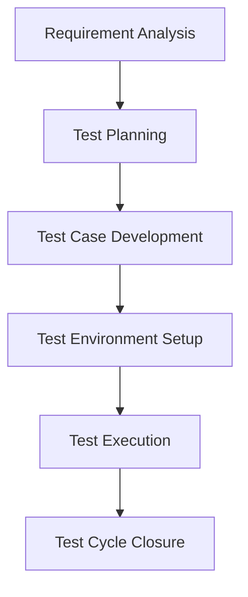

Software testing is far more than just identifying bugs; it's a meticulously structured process designed to ensure that a software application not only meets its specified requirements but also delivers a flawless user experience. The **Software Testing Life Cycle (STLC)** provides a systematic framework that guides every step of this critical process, from initial planning and design to execution and final closure. By rigorously adhering to the STLC, testing efforts become highly efficient, remarkably effective, and perfectly aligned with overarching project goals.

This comprehensive guide will take you on a deep dive into each phase of the STLC, offering a thorough understanding of the testing process and equipping you with the best practices essential for each stage. Whether you're a budding QA professional or a seasoned developer, mastering the STLC is key to delivering high-quality software consistently.

## Key Takeaways

*   **The STLC is a six-phase process:** Requirement Analysis, Test Planning, Test Case Development, Test Environment Setup, Test Execution, and Test Cycle Closure.
*   **Each phase has specific entry and exit criteria:** These must be met before moving on to the next phase.
*   **The STLC is a flexible framework:** It can be adapted to fit the needs of any project.
*   **Benefits of STLC:** Improves quality, reduces costs, and enhances efficiency.
*   **Challenges in STLC Implementation:** Requires clear communication, proper planning, and skilled resources.

---

## Table of Contents

- [Key Takeaways](#key-takeaways)
- [Table of Contents](#table-of-contents)
- [The Six Phases of the Software Testing Life Cycle (STLC)](#the-six-phases-of-the-software-testing-life-cycle-stlc)
  - [Phase 1: Requirement Analysis](#phase-1-requirement-analysis)
  - [Phase 2: Test Planning](#phase-2-test-planning)
  - [Phase 3: Test Case Development](#phase-3-test-case-development)
  - [Phase 4: Test Environment Setup](#phase-4-test-environment-setup)
  - [Phase 5: Test Execution](#phase-5-test-execution)
  - [Phase 6: Test Cycle Closure](#phase-6-test-cycle-closure)
- [Benefits of STLC](#benefits-of-stlc)
- [Challenges in STLC Implementation](#challenges-in-stlc-implementation)
- [Frequently Asked Questions (FAQ)](#frequently-asked-questions-faq)
- [Conclusion](#conclusion)

---

## The Six Phases of the Software Testing Life Cycle (STLC)

The STLC is a systematic and iterative process, ensuring that quality is embedded at every stage of software development. This cyclical process typically consists of six distinct phases, each with its own objectives, activities, and deliverables:

### Phase 1: Requirement Analysis

**Goal:** To thoroughly understand the software requirements from a testing perspective, identify testable requirements, and define the scope of testing.

**Activities:** Review and analyze requirements, identify testable requirements, define scope of testing, prepare Requirement Traceability Matrix (RTM), identify test conditions.

**Entry Criteria:** SRS or other relevant requirement documents are available and formally approved.

**Exit Criteria:** All testable requirements identified, scope defined, RTM prepared, test conditions identified.

### Phase 2: Test Planning

**Goal:** To define the overall testing strategy, scope, objectives, resources, and schedule for the entire testing effort.

**Activities:** Develop Test Plan, define Test Strategy, resource planning, test estimation, risk identification and mitigation, define test environment requirements.

**Entry Criteria:** Requirement Analysis phase is complete, and the RTM is finalized.

**Exit Criteria:** Test Plan document prepared, reviewed, and approved; estimations finalized; risks identified; environment requirements defined.

### Phase 3: Test Case Development

**Goal:** To design and develop detailed test cases, test scripts, and test data based on the identified requirements and test plan.

**Activities:** Design Test Cases, prioritize Test Cases, develop Test Scripts (for automation), prepare Test Data, review Test Cases and Scripts, update Traceability Matrix. For more on this, see our guide on [How to Write Test Case for Software](/how-to-write-test-case-for-software/).

**Entry Criteria:** Test Planning phase is complete, and the Test Plan document is approved.

**Exit Criteria:** All required test cases designed, reviewed, and approved; test data prepared; test scripts developed; RTM updated.

### Phase 4: Test Environment Setup

**Goal:** To prepare and configure the necessary hardware, software, and network infrastructure where the testing activities will be performed.

**Activities:** Understand Environment Requirements, Set Up Test Environment, Install Application Under Test (AUT), Configure Test Data, Perform Smoke Testing/Environment Sanity Check, Troubleshoot and Resolve Issues.

**Entry Criteria:** Test Plan approved and includes detailed test environment requirements; test cases and test data ready.

**Exit Criteria:** Test environment fully set up, configured, and stable; AUT deployed and accessible; successful environment sanity check performed.

### Phase 5: Test Execution

**Goal:** To systematically execute the designed test cases, record the results, and identify and report any defects found.

**Activities:** Execute Test Cases, Record Test Results, Log Defects, Retest Defects, Perform Regression Testing, Track Defects. For more on this, see our guide on [How to Write an Effective Bug Report](/how-to-write-an-effective-bug-report/).

**Entry Criteria:** Test Environment set up and stable; test cases and test data ready and approved; AUT deployed and accessible.

**Exit Criteria:** All planned test cases executed; test results recorded and analyzed; all identified defects logged, tracked, and retested; regression testing completed.

### Phase 6: Test Cycle Closure

**Goal:** To formally conclude the testing process, evaluate the overall testing effort, and prepare a comprehensive report for stakeholders.

**Activities:** Evaluate Test Cycle Completion, Prepare Test Summary Report, Archive Test Artifacts, Conduct Lessons Learned Meeting, Handover Documentation.

**Entry Criteria:** Test Execution phase is complete; all critical and high-priority defects are closed or deferred with stakeholder approval; exit criteria for the current test cycle are met.

**Exit Criteria:** Test Summary Report prepared, reviewed, and approved; all test artifacts archived; lessons learned documented and shared; formal sign-off obtained.

---

## Benefits of STLC

Implementing the STLC offers significant advantages:

*   **Improved Quality:** Ensures thorough testing, leading to higher quality software.
*   **Reduced Costs:** Identifies defects early, making them cheaper to fix.
*   **Enhanced Efficiency:** Provides a structured approach, optimizing testing efforts.
*   **Better Planning:** Facilitates accurate test planning and resource allocation.
*   **Increased Transparency:** Provides clear visibility into the testing process and progress.

---

## Challenges in STLC Implementation

While beneficial, STLC implementation can face challenges:

*   **Lack of Clear Requirements:** Ambiguous requirements can lead to ineffective test cases.
*   **Resource Constraints:** Insufficient human or technical resources can hinder thorough testing.
*   **Tight Deadlines:** Pressure to meet deadlines can lead to skipping testing phases.
*   **Communication Gaps:** Poor communication between teams can result in misunderstandings and delays.
*   **Resistance to Change:** Teams may resist adopting a structured testing process.

---

## Frequently Asked Questions (FAQ)

**Q1: Is STLC applicable to Agile projects?**
A1: Yes, while Agile emphasizes continuous testing, the core principles of STLC (planning, execution, closure) are still relevant and adapted to fit the iterative nature of Agile. For more on this, see our guide on [Agile-Scrum-in-a-Nutshell](/agile-scrum-in-a-nutshell/).

**Q2: What is the difference between STLC and SDLC?**
A2: SDLC (Software Development Life Cycle) is the overall process of software development, while STLC (Software Testing Life Cycle) is a subset of SDLC, focusing specifically on testing activities.

**Q3: How do I measure the success of my STLC implementation?**
A3: Success can be measured by metrics such as defect detection rate, test coverage, number of escaped defects (bugs found after release), and overall project quality.

---

## Conclusion

Mastering the Software Testing Life Cycle (STLC) is paramount for any team committed to delivering high-quality software. By systematically navigating through each phase—from meticulous Requirement Analysis and strategic Test Planning to diligent Test Execution and insightful Test Cycle Closure—organizations can significantly enhance their quality assurance efforts.

Embracing the STLC not only streamlines the testing process but also fosters a proactive approach to defect prevention, reduces development costs, and ultimately leads to the creation of more robust, reliable, and user-satisfying software products. Invest in understanding and implementing the STLC, and you'll build a strong foundation for continuous quality improvement in your software development endeavors.

**What's your biggest challenge in implementing a structured testing process? Share your thoughts in the comments below!**


