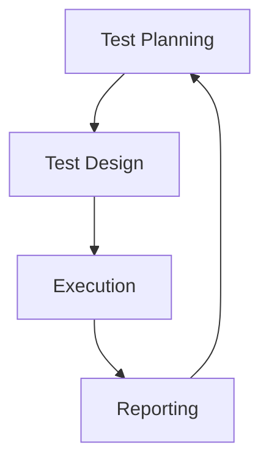

**Software testing** isn’t just about finding bugs—it’s about building confidence.  
When done right, testing ensures your application is reliable, functional, and ready for the real world.

In this post, we’ll guide you through every critical phase of the **software testing lifecycle**, from planning to closure—complete with best practices to streamline your testing process and deliver software users trust.

After years leading QA teams, I've seen this scenario too often. The fix isn't more testing - it's _smarter_ testing. This guide distills battle-tested frameworks to transform your testing from chaotic to clinical.  
e.

_Quick Link to Specific Topic:_

- [Test Planning and Control:](#test-planning-and-control)
  - [Defining test objectives and scope:](#defining-test-objectives-and-scope)
  - [Test strategy development:](#test-strategy-development)
  - [Test estimation and scheduling:](#test-estimation-and-scheduling)
  - [Test documentation:](#test-documentation)
  - [Test environment setup:](#test-environment-setup)
  - [Test progress monitoring and control:](#test-progress-monitoring-and-control)
  - [Best Practices for Test Planning and Control:](#best-practices-for-test-planning-and-control)
- [Test Analysis and Design:](#test-analysis-and-design)
  - [Test basis analysis:](#test-basis-analysis)
  - [Test conditions identification:](#test-conditions-identification)
  - [Test case design:](#test-case-design)
  - [Test data identification:](#test-data-identification)
  - [Test environment and infrastructure planning:](#test-environment-and-infrastructure-planning)
  - [Best Practices for Test Analysis and Design:](#best-practices-for-test-analysis-and-design)
- [Implementation and Execution:](#implementation-and-execution)
  - [Test execution:](#test-execution)
  - [Defect reporting and tracking:](#defect-reporting-and-tracking)
  - [Regression testing:](#regression-testing)
  - [Test data management:](#test-data-management)
  - [Test environment configuration management:](#test-environment-configuration-management)
  - [Best Practices for Implementation and Execution:](#best-practices-for-implementation-and-execution)
- [Test Exit Criteria and Report Evaluation:](#test-exit-criteria-and-report-evaluation)
  - [Test completion criteria:](#test-completion-criteria)
  - [Test summary and report generation:](#test-summary-and-report-generation)
  - [Defect analysis:](#defect-analysis)
  - [Lessons learned and feedback:](#lessons-learned-and-feedback)
  - [Best Practices for Test Exit Criteria and Report Evaluation:](#best-practices-for-test-exit-criteria-and-report-evaluation)

---

## Why Testing Processes Fail (And How to Fix Them)

Most teams stumble because they:

- Treat testing as a final "checkmark" phase
- Prioritize speed over risk-based coverage
- Lack clear exit criteria ("Are we done yet?")
- Ignore test environment mismatches

> **The result**: 40% of software failures trace back to preventable testing gaps (IBM Research).

Here's how elite QA teams structure their process:



---

## Phase 1: Test Planning & Control - Your QA Battle Plan

### The 6 Commandments of Effective Planning

1. **Objective Setting**

   - _Bad_: "Test the login feature"
   - _Good_: "Verify 10,000 concurrent logins with <2s response under AWS load balancer"

2. **Scope Fencing**  
   Use the _Risk Matrix_:  
   | Impact/Probability | High | Medium | Low |
   | ------------------ | ---------- | ---------- | ------ |
   | **High** | Test First | Test Early | Sample |
   | **Medium** | Test Early | Sample | Ignore |
   | **Low** | Sample | Ignore | Ignore |

3. **Strategy Selection**

   - _Waterfall_: Full documentation upfront
   - _Agile_: Risk-based exploratory sprints

4. **Estimation Science**

   ```plaintext
   Test Hours = (Test Cases × Avg. Execution Time) × 1.5 (Review/Bug Fix Buffer)
   ```

5. **Environment Strategy**

   - _Golden Rule_: Mirror production 1:1 (data sanitized)

6. **Progress Tracking**
   - Daily defect burn-down charts
   - Automation coverage % dashboards

> **Pro Toolkit**: Jira Xray, TestRail, qTest

---

## Phase 2: Test Analysis & Design - Building Your QA Arsenal

### Transform Requirements into Test Weapons

**The Test Condition Framework**:

```gherkin
Given [Precondition]
When [Action]
Then [Expected Result]
```

_Example_:

```gherkin
Given user has 2FA enabled
When entering correct password + expired OTP
Then system blocks login AND alerts security team
```

### Data Design Secrets

| Data Type      | Purpose               | Example                        |
| -------------- | --------------------- | ------------------------------ |
| **Happy Path** | Validate requirements | Valid credit card              |
| **Boundary**   | Stress limits         | $0.01 transaction              |
| **Poison**     | Break systems         | SQL `DROP TABLE` in name field |

> 💡 **Design Hack**: Use pairwise tools (Hexawise, PICT) to cover 80% scenarios with 20% cases

---

## Phase 3: Execution & Defense - The QA War Room

### The Execution Triad

| Activity             | Goal               | Tools              |
| -------------------- | ------------------ | ------------------ |
| **Test Runs**        | Validate behavior  | Selenium, Cypress  |
| **Defect Triage**    | Prioritize fixes   | Jira, Bugzilla     |
| **Regression Guard** | Prevent new breaks | Jenkins, GitLab CI |

### Real-World Battle Tactics

1. **Bug Reporting That Gets Fixed**

   ```markdown
   Title: [High] Payment fails for AMEX cards over $1000  
   Steps:

   1. Select AMEX card
   2. Enter $1001
   3. Click "Pay Now"  
      Actual: "Error: Invalid amount"  
      Expected: Successful payment confirmation  
      Environment: iOS 17.4, Payment Gateway v3.2
   ```

2. **Regression Prevention**
   - Automate smoke tests for critical paths
   - Reserve 30% sprint time for debt reduction

---

## Phase 4: Exit & Evaluation - The QA Verdict

### The Release Readiness Checklist

```plaintext
✅ 100% critical test cases passed
✅ Zero P1 defects open
✅ Performance SLA met (≤2s page load)
✅ Security scan clean (OWASP ZAP)
✅ UAT signoff from 5+ real users
```

### The Post-Mortem That Actually Improves Things

1. **Defect Autopsy**

   - Root cause analysis: Why did bugs escape?
   - Pattern mapping: Are failures clustering in modules?

2. **Metrics That Matter**  
   | Metric | Formula | Target |
   | ------------------- | ----------------------------------- | ------ |
   | **Escape Rate** | Prod bugs / Test bugs | <5% |
   | **Test Efficiency** | Bugs found pre-release / Total bugs | >85% |

3. **Knowledge Packaging**
   - Create "Lessons Learned" wiki pages
   - Build regression test vault for future teams

---

## Your 30-Day Testing Transformation Plan

1. **Week 1: Process Audit**

   - Map current testing workflow
   - Identify 3 biggest leakage points

2. **Week 2: Toolchain Upgrade**

   - Implement test case management
   - Setup CI/CD regression guard

3. **Week 3: Metrics Baseline**

   - Track escape rate & test efficiency
   - Establish quality KPIs with stakeholders

4. **Week 4: Retro & Scale**
   - Run first formal test retrospective
   - Document improved workflow

> **"Quality isn't tested in - it's architected in. Testing just proves it."**

---

Software testing isn’t just a phase—it’s a strategy for success.

By following a structured testing lifecycle and embracing best practices at every step, you’ll reduce defects, improve user experience, and deliver products that win trust and stand the test of time.

---

**📌 What’s Your Biggest Testing Challenge?**  
Let’s talk—drop your thoughts in the comments or reach out for a QA consultation.

**[⬆ back to top](#test-planning-and-control)**



{: .box-success}
Enjoy !!!
Keep testing smart—See ya in the next post!


