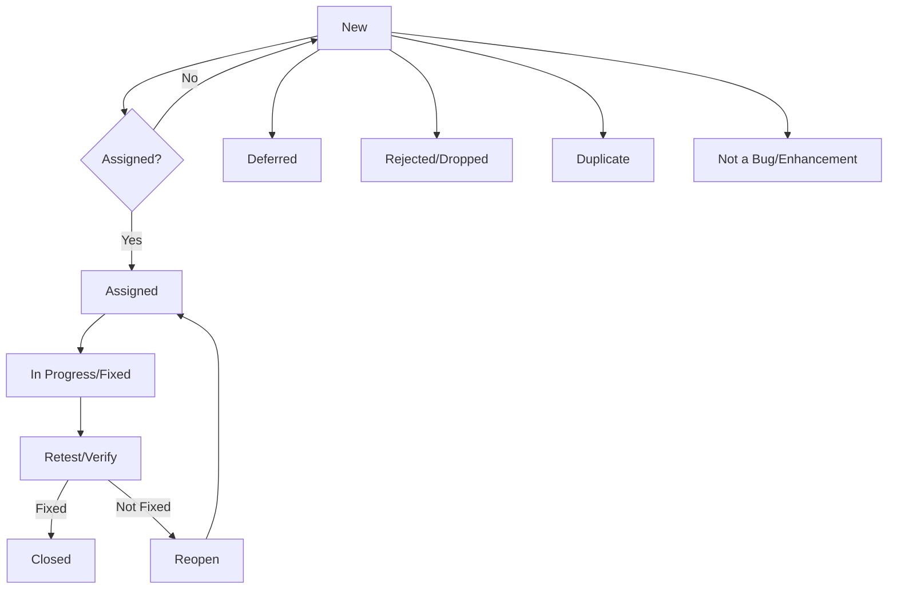

In the dynamic world of software development, delivering a high-quality, defect-free product is the ultimate goal. While identifying bugs is a critical first step, the journey a bug takes from discovery to resolution is equally, if not more, vital. This systematic process is known as the **Bug Life Cycle**, or **[Defect Life Cycle](/software-testing-terms-of-glossary/)**.

A well-defined and efficiently managed Bug Life Cycle is fundamental for every software tester, developer, and project manager. It not only streamlines communication and enhances team efficiency but also significantly contributes to the overall quality, stability, and reliability of the software. By understanding each stage, teams can ensure that defects are tracked, prioritized, fixed, and verified effectively, minimizing their impact on the final product.

This comprehensive guide will walk you through each essential stage of the Bug Life Cycle, explaining its significance, the typical roles involved, and how it contributes to robust software quality assurance. While the exact flow and terminology might vary slightly across different organizations and projects, the core principles and objectives remain universally consistent.

## Key Takeaways

*   **Systematic Process:** The Bug Life Cycle is a structured workflow that tracks a defect from its discovery to its closure.
*   **Improved Communication:** It provides a common language and framework for testers, developers, and project managers to communicate about bugs.
*   **Enhanced Efficiency:** A well-managed life cycle streamlines the bug resolution process, reducing delays and rework.
*   **Higher Quality Software:** By ensuring defects are properly managed and verified, it directly contributes to the overall quality and reliability of the software product.

---

## The Stages of the Bug Life Cycle

Let's have a look at the various stages of a bug's life cycle:

### New/Open Status

This is the initial stage in the Bug Life Cycle. It begins when a test engineer or end-user discovers a defect and logs it into a bug tracking system (e.g., Jira, Bugzilla, Azure DevOps). At this point, the bug is typically given a 'New' status. Key actions in this stage include:

*   **Bug Discovery & Reporting**: The tester identifies an anomaly, gathers relevant information (steps to reproduce, expected vs. actual results, environment details, screenshots/videos), and creates a detailed bug report.
*   **Initial Review & Validation**: A QA lead or project manager reviews the newly reported bug to ensure it's a legitimate defect, not a user error or a duplicate. They might also assess its initial severity and priority.
*   **Status Transition**: If validated, the bug's status transitions to 'Open' or 'Active,' signifying that it's a confirmed issue ready for further action. It's now in the queue for a developer to investigate and resolve. At this point, it might also be assigned to a specific developer or development team, or remain unassigned until a team lead allocates it.

### Assigned Status

Once a bug is in the 'New/Open' state and has been validated, it is assigned to a specific developer or development team. This assignment is typically done by a team lead or project manager, indicating that the bug has been acknowledged and is now the responsibility of the assigned party to investigate and resolve. Key activities during this stage include:

*   **Developer Analysis**: The assigned developer thoroughly analyzes the bug report, attempting to reproduce the issue in their local environment.
*   **Root Cause Identification**: The developer investigates the codebase to pinpoint the exact cause of the defect.
*   **Status Update**: The bug's status might be updated to 'Assigned' or 'In Progress' (depending on the workflow) to reflect that work has begun.

### In Progress/Fixed Status

Once a bug is assigned, the developer begins working on its resolution. During this phase, the bug's status is typically 'In Progress' or 'Active'. The developer implements the necessary code changes to rectify the defect. Once the fix is implemented and unit-tested by the developer, they mark its status as 'Fixed'. This indicates that the bug has been addressed and is ready for retesting by the QA team. It's crucial that the developer provides clear notes on the fix, which can aid the tester during verification.

### Retest/Verify Status

After the developer marks a bug as 'Fixed', it moves to the 'Retest/Verify' stage. Here, the QA tester re-examines the functionality to confirm that the bug has indeed been resolved and that no new issues (regressions) have been introduced. This involves executing the original test case that identified the bug, along with any related test cases. If the bug is no longer reproducible and the functionality works as expected, the bug can proceed to the 'Closed' stage. If the bug is still present, it will be reopened and sent back to the developer.

### Reopen Status

If, during the 'Retest/Verify' stage, the QA tester finds that the bug has not been fixed correctly, or if the fix introduced new issues, the bug's status is changed to 'Reopen'. This signifies that the bug is still active and needs further attention from the development team. When a bug is reopened, it typically goes back to the 'Assigned' or 'In Progress' stage for the developer to re-investigate and provide a new fix. It's crucial to provide clear details on why the bug was reopened to avoid miscommunication and expedite the resolution process.

### Deferred Status

If a bug is identified but not fixed immediately, its status is marked as 'Deferred'. This means the bug will be addressed in a future release or iteration of the software. Common reasons for deferring a bug include:

*   **Lower Priority**: The bug's impact is minimal, and higher-priority issues need immediate attention.
*   **Time Constraints**: There isn't enough time to fix the bug before the current release deadline.
*   **Future Enhancements**: The bug might be related to a feature planned for a later development phase.
*   **Complexity**: The fix requires significant effort or architectural changes that cannot be accommodated in the current sprint/release.

### Dropped/Rejected Status

A bug is marked as 'Dropped' or 'Rejected' when the development team determines that it is not a valid defect and will not be fixed. This decision is typically made after careful review and can occur for several reasons:

*   **Not a Bug**: The reported issue is actually intended functionality or a misunderstanding of the system's behavior.
*   **Cannot Reproduce**: The developer is unable to consistently reproduce the bug, even after following the provided steps.
*   **Out of Scope**: The issue falls outside the current project's scope or requirements.
*   **Low Priority/Impact**: The bug's impact is so negligible that fixing it is not justified given the effort required.

When a bug is rejected, the developer should provide a clear explanation for the decision, which is then communicated back to the tester.

### Duplicate Status

A bug is marked as 'Duplicate' when it is found to be identical to an issue that has already been reported and is either active, fixed, or closed. This often happens in larger projects with multiple testers or when different users encounter the same problem independently. When a bug is marked as duplicate, it is typically linked to the original bug report, and no further action is taken on the duplicate. This helps in maintaining a clean bug tracking system and avoids redundant efforts.

### Closed Status

The 'Closed' status signifies the successful completion of the Bug Life Cycle for a particular defect. This stage is reached after the QA tester has thoroughly verified the fix and confirmed that the bug is no longer reproducible and that the affected functionality works as expected. Key aspects of this stage include:

*   **Final Verification**: The tester performs a comprehensive retest, ensuring the original issue is resolved and no new regressions have been introduced.
*   **Confirmation**: Once satisfied, the tester updates the bug's status to 'Closed'.
*   **Documentation**: The bug report is archived, serving as a record of the issue and its resolution. This historical data can be valuable for future analysis, knowledge sharing, and process improvement.

### Not a Bug / Enhancement Status

This status is used when the reported issue is not considered a defect but rather a request for a new feature, an improvement to existing functionality, or a misunderstanding of the application's design. In such cases, the issue is typically reclassified:

*   **Not a Bug**: If the reported behavior is actually the intended functionality.
*   **Enhancement**: If the request is for a new feature or an improvement that goes beyond fixing a defect. These are often moved to a separate backlog for future consideration and development.

---

## Best Practices for Effective Bug Life Cycle Management

To ensure a smooth and efficient bug life cycle, consider implementing these best practices:

*   **Clear Communication:** Foster open and transparent communication between all stakeholders (testers, developers, project managers). Use a centralized bug tracking tool to ensure everyone has access to the latest information.
*   **Detailed Bug Reports:** As discussed in our guide on [How to Write an Effective Bug Report](/2018/09/20/How-to-Write-an-Effective-Bug-Report.html), provide clear, concise, and reproducible steps, along with expected and actual results, screenshots, and environmental details.
*   **Prioritization and Severity:** Clearly define and consistently apply severity and priority levels to bugs. This helps the team focus on the most critical issues first.
*   **Regular Triage Meetings:** Conduct regular bug triage meetings with relevant stakeholders to review new bugs, prioritize them, and assign them to developers.
*   **Automate Where Possible:** Automate repetitive tasks in the bug life cycle, such as notifications, status updates, and report generation.
*   **Continuous Improvement:** Regularly review your bug life cycle process to identify bottlenecks, areas for improvement, and opportunities to streamline the workflow.

---

## Conclusion

Mastering the Bug Life Cycle is not just a theoretical exercise; it's a practical necessity for anyone involved in software development and quality assurance. A well-understood and efficiently managed defect life cycle ensures that bugs are not just found, but effectively tracked, prioritized, fixed, and verified. This systematic approach minimizes the impact of defects, improves communication between development and testing teams, and ultimately leads to the delivery of higher-quality, more reliable software products. By embracing these stages, organizations can foster a culture of quality, reduce development costs, and enhance user satisfaction.

**Ready to streamline your bug management process?** Start by reviewing your current bug life cycle and identify areas where you can implement the best practices discussed in this guide. Share your experiences and challenges in the comments below!

